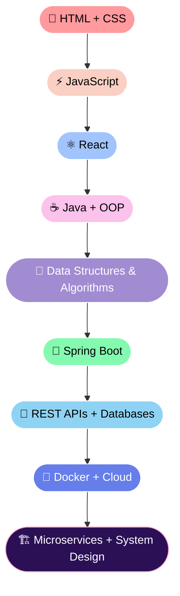

<!-- ═══════════════ 🌸 ANIME HEADER ═══════════════ -->

 

🌸 &nbsp;`( •̀ ω •́ )✧` &nbsp;**ようこそ — Welcome to my profile!** &nbsp;`(≧◡≦)` &nbsp;🌸

 

  

<!--
  🎌 WANT AN ANIME GIF? Paste your own below (keep it centered):
  

-->

# 💫 About Me &nbsp;自己紹介

Hi, I'm **Laxmidhar Sahoo** 👋
I'm a passionate **BCA student and aspiring Full-Stack Java Developer** who enjoys building real-world applications and solving programming problems.

### 🎴 Player Status Window

<table>
<tr>
<td>

🌱 **Currently learning:** JavaScript, React, Java, Spring Boot & Data Structures & Algorithms
💡 **Interested in:** Full-Stack Development, Backend Engineering, System Design & Problem Solving
🚀 **Working on:** Real-world web applications and improving my development skills
🧠 **Practicing:** Java, DSA & LeetCode problems
🔨 **Building:** Full-stack projects using React and Spring Boot
🎯 **Goal:** To become a highly skilled **Software Engineer** and build scalable, impactful software
💻 **Mindset:** Learn → Build → Break → Fix → Improve

</td>
</tr>
</table>

# 🛠️ Skills &nbsp;スキル

| ⚔️ Category | 🗡️ Technologies |
|:--|:--|
| **Programming** | Java, C, Python, JavaScript |
| **Frontend** | HTML, CSS, JavaScript, React |
| **Backend** | Java, Spring Boot, REST APIs |
| **Database** | MySQL, PostgreSQL |
| **Concepts** | OOP, Data Structures & Algorithms, DBMS |
| **Tools** | Git, GitHub, VS Code, IntelliJ IDEA, Docker |
| **Currently Exploring** | Microservices, Cloud Deployment & System Design |

# 💻 Tech Stack &nbsp;技術スタック

# 🧩 Featured Projects &nbsp;プロジェクト

<table>
<tr>
<td width="50%" valign="top">

### 🚀 CodeGuard AI
AI-powered application focused on helping developers analyze and improve code.

</td>
<td width="50%" valign="top">

### 🌾 AgriConnect
A full-stack platform designed to connect agriculture-related users and services.

</td>
</tr>
<tr>
<td width="50%" valign="top">

### 📚 Student Study Dashboard
A web-based dashboard for managing study activities and tracking academic progress.

</td>
<td width="50%" valign="top">

### 🎓 Student Record Management System
Backend application for managing student records through REST APIs.

</td>
</tr>
</table>

# 📊 GitHub Stats &nbsp;統計

### 🏆 GitHub Trophies

# 📈 My Development Journey &nbsp;冒険の地図

# 🎯 2026 Goals &nbsp;目標

- [ ] 🚀 Become strong in Java & Spring Boot
- [ ] 🧠 Solve more DSA & LeetCode problems
- [ ] ⚛️ Build advanced React applications
- [ ] 🔗 Build production-ready full-stack projects
- [ ] 🐳 Learn Docker & cloud deployment
- [ ] 🏗️ Understand system design
- [ ] 💼 Prepare for software engineering roles
- [ ] 🌎 Contribute to open-source projects

# ✍️ Random Dev Quote &nbsp;名言

> "Professionalism has no place in art, and hacking is art.
> Software Engineering might be science; but that's not what I do.
> I'm a hacker, not an engineer."
> — **Jamie Zawinski**

 

🌸 `(｡•̀ᴗ-)✧` &nbsp;**ありがとう — Thanks for visiting!** &nbsp;`(≧▽≦)/` 🌸

<!-- Proudly created with GPRM -->
